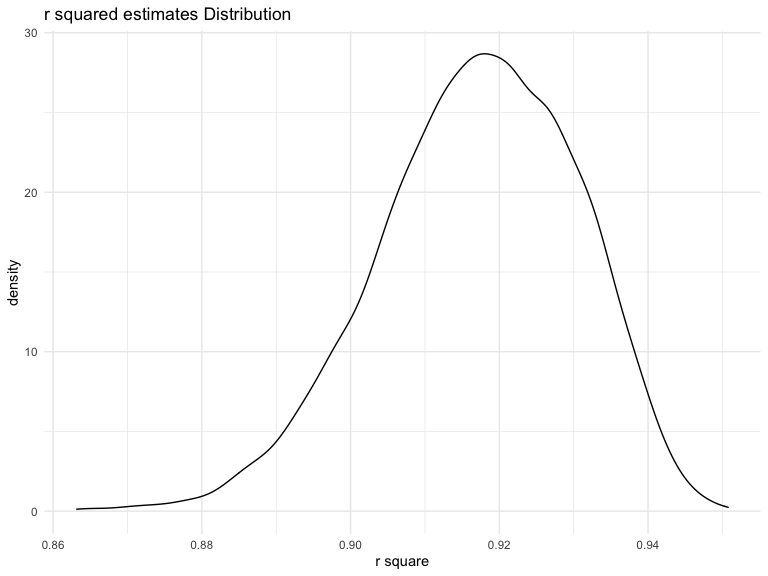
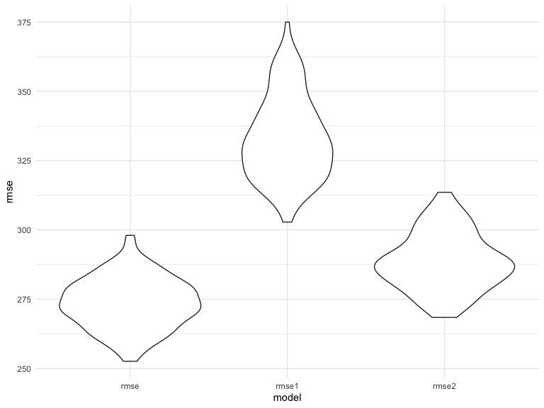

p8105_hw6_lz2950
================
Lehan Zou
2023-12-03

### Due date

Due: December 3 at 11:59pm.

### Points

| Problem   | Points |
|:----------|:-------|
| Problem 0 | 20     |
| Problem 1 | –      |
| Problem 2 | 40     |
| Problem 3 | 40     |

### Problem 0

This “problem” focuses on structure of your assignment, including the
use of R Markdown to write reproducible reports, the use of R Projects
to organize your work, the use of relative paths to load data, and the
naming structure for your files.

To that end:

- create a public GitHub repo + local R Project for this assignment
- write solutions using a .Rmd file that outputs a `github_document` /
  .md file
- submit a link to your repo via Courseworks

Your solutions to Problems 1 and 2 should be implemented in your .Rmd
file, and your git commit history should reflect the process you used to
solve these Problems.

For Problem 0, we will assess adherence to the instructions above
regarding repo structure, git commit history, and whether we are able to
knit your .Rmd to ensure that your work is reproducible. Adherence to
appropriate styling and clarity of code will be assessed in Problems 1+
using the homework [style rubric](homework_style_rubric.html).

This homework includes figures; the readability of your embedded plots
(e.g. font sizes, axis labels, titles) will be assessed in Problems 1+.

``` r
library(tidyverse)
library(modelr)
```

### Problem 1

In the data cleaning code below we create a `city_state` variable,
change `victim_age` to numeric, modifiy victim_race to have categories
white and non-white, with white as the reference category, and create a
`resolution` variable indicating whether the homicide is solved. Lastly,
we filtered out the following cities: Tulsa, AL; Dallas, TX; Phoenix,
AZ; and Kansas City, MO; and we retained only the variables
`city_state`, `resolution`, `victim_age`, `victim_sex`, and
`victim_race`.

``` r
homicide_df = 
  read_csv("data/homicide-data.csv", na = c("", "NA", "Unknown")) |> 
  mutate(
    city_state = str_c(city, state, sep = ", "),
    victim_age = as.numeric(victim_age),
    resolution = case_when(
      disposition == "Closed without arrest" ~ 0,
      disposition == "Open/No arrest"        ~ 0,
      disposition == "Closed by arrest"      ~ 1)
  ) |> 
  filter(victim_race %in% c("White", "Black")) |> 
  filter(!(city_state %in% c("Tulsa, AL", "Dallas, TX", "Phoenix, AZ", "Kansas City, MO"))) |> 
  select(city_state, resolution, victim_age, victim_sex, victim_race)
```

    ## Rows: 52179 Columns: 12
    ## ── Column specification ────────────────────────────────────────────────────────
    ## Delimiter: ","
    ## chr (8): uid, victim_last, victim_first, victim_race, victim_sex, city, stat...
    ## dbl (4): reported_date, victim_age, lat, lon
    ## 
    ## ℹ Use `spec()` to retrieve the full column specification for this data.
    ## ℹ Specify the column types or set `show_col_types = FALSE` to quiet this message.

Next we fit a logistic regression model using only data from Baltimore,
MD. We model `resolved` as the outcome and `victim_age`, `victim_sex`,
and `victim_race` as predictors. We save the output as `baltimore_glm`
so that we can apply `broom::tidy` to this object and obtain the
estimate and confidence interval of the adjusted odds ratio for solving
homicides comparing non-white victims to white victims.

``` r
baltimore_glm = 
  filter(homicide_df, city_state == "Baltimore, MD") |> 
  glm(resolution ~ victim_age + victim_sex + victim_race, family = binomial(), data = _)

baltimore_glm |> 
  broom::tidy() |> 
  mutate(
    OR = exp(estimate), 
    OR_CI_upper = exp(estimate + 1.96 * std.error),
    OR_CI_lower = exp(estimate - 1.96 * std.error)) |> 
  filter(term == "victim_sexMale") |> 
  select(OR, OR_CI_lower, OR_CI_upper) |>
  knitr::kable(digits = 3)
```

|    OR | OR_CI_lower | OR_CI_upper |
|------:|------------:|------------:|
| 0.426 |       0.325 |       0.558 |

Below, by incorporating `nest()`, `map()`, and `unnest()` into the
preceding Baltimore-specific code, we fit a model for each of the
cities, and extract the adjusted odds ratio (and CI) for solving
homicides comparing non-white victims to white victims. We show the
first 5 rows of the resulting dataframe of model results.

``` r
model_results = 
  homicide_df |> 
  nest(data = -city_state) |> 
  mutate(
    models = map(data, \(df) glm(resolution ~ victim_age + victim_sex + victim_race, 
                             family = binomial(), data = df)),
    tidy_models = map(models, broom::tidy)) |> 
  select(-models, -data) |> 
  unnest(cols = tidy_models) |> 
  mutate(
    OR = exp(estimate), 
    OR_CI_upper = exp(estimate + 1.96 * std.error),
    OR_CI_lower = exp(estimate - 1.96 * std.error)) |> 
  filter(term == "victim_sexMale") |> 
  select(city_state, OR, OR_CI_lower, OR_CI_upper)

model_results |>
  slice(1:5) |> 
  knitr::kable(digits = 3)
```

| city_state      |    OR | OR_CI_lower | OR_CI_upper |
|:----------------|------:|------------:|------------:|
| Albuquerque, NM | 1.767 |       0.831 |       3.761 |
| Atlanta, GA     | 1.000 |       0.684 |       1.463 |
| Baltimore, MD   | 0.426 |       0.325 |       0.558 |
| Baton Rouge, LA | 0.381 |       0.209 |       0.695 |
| Birmingham, AL  | 0.870 |       0.574 |       1.318 |

Below we generate a plot of the estimated ORs and CIs for each city,
ordered by magnitude of the OR from smallest to largest. From this plot
we see that most cities have odds ratios that are smaller than 1,
suggesting that crimes with male victims have smaller odds of resolution
compared to crimes with female victims after adjusting for victim age
and race. This disparity is strongest in New yrok. In roughly half of
these cities, confidence intervals are narrow and do not contain 1,
suggesting a significant difference in resolution rates by sex after
adjustment for victim age and race.

``` r
model_results |> 
  mutate(city_state = fct_reorder(city_state, OR)) |> 
  ggplot(aes(x = city_state, y = OR)) + 
  geom_point() + 
  geom_errorbar(aes(ymin = OR_CI_lower, ymax = OR_CI_upper)) + 
  theme(axis.text.x = element_text(angle = 90, hjust = 1))
```


### Problem 2

**The boostrap is helpful when you’d like to perform inference for a
parameter / value / summary that doesn’t have an easy-to-write-down
distribution in the usual repeated sampling framework. We’ll focus on a
simple linear regression with `tmax` as the response with `tmin` and
`prcp` as the predictors, and are interested in the distribution of two
quantities estimated from these data:**

- $\hat{r}^2$

- $log(\hat{\beta_1} * \hat{\beta_2})$

\*\*Use 5000 bootstrap samples and, for each bootstrap sample, produce
estimates of these two quantities. Plot the distribution.

First, download the data.

``` r
weather_df = 
  rnoaa::meteo_pull_monitors(
    c("USW00094728"),
    var = c("PRCP", "TMIN", "TMAX"), 
    date_min = "2022-01-01",
    date_max = "2022-12-31") |>
  mutate(
    name = recode(id, USW00094728 = "CentralPark_NY"),
    tmin = tmin / 10,
    tmax = tmax / 10) |>
  select(name, id, everything())
```

    ## Registered S3 method overwritten by 'hoardr':
    ##   method           from
    ##   print.cache_info httr

    ## using cached file: /Users/zouzou/Library/Caches/org.R-project.R/R/rnoaa/noaa_ghcnd/USW00094728.dly

    ## date created (size, mb): 2023-12-02 19:59:22 (8.544)

    ## file min/max dates: 1869-01-01 / 2023-11-30

``` r
boot_sample = function(df) {
  sample_frac(df, replace = TRUE)
}

boot_strap = weather_df |>
  modelr::bootstrap(n = 5000) |> 
  mutate(
    models = map(strap, \(df) lm(tmax ~ tmin + prcp, data = df)),
    r_square = map(models, broom::tidy),
    beta = map(models, broom::glance))|> 
  unnest(r_square, beta) |>
  select(.id, term, estimate, r.squared) |>
  pivot_wider(names_from = term, values_from = estimate)

var = boot_strap |>
  summarise(r.squared = r.squared,
    log_beta12 = log(tmin * prcp))
```

``` r
var |> 
  ggplot(aes(x = r.squared)) +
  geom_density() +
  labs(title = "r squared estimates Distribution",
       x = "r square")
```


This plot of r square is left skewed with the mode around 0.92.But this
distribution is approximately normal.

``` r
var |>
  ggplot(aes(x = log_beta12)) +
  geom_density() +
  labs(title = "log_beta1 * log_beta2 Estimate Distribution",
       x = "log_beta1 * log_beta2")
```


This plot of log_beta1\*log_beta2 is also left skewed with some
outliers.

``` r
tibble(
  r_square_low = var |> pull(r.squared) |> quantile(0.025),
  r_square_high = var |> pull(r.squared) |> quantile(0.975),
  log_beta_low = var |> pull(log_beta12) |> quantile(0.025, na.rm = T),
  log_beta_high = var |> pull(log_beta12) |> quantile(0.975, na.rm = T)
) |> 
  knitr::kable()
```

| r_square_low | r_square_high | log_beta_low | log_beta_high |
|-------------:|--------------:|-------------:|--------------:|
|      0.88876 |     0.9397018 |    -8.822717 |     -4.545832 |

### Problem 3

``` r
birthwt =
  read_csv("data/birthweight.csv") |> 
  janitor::clean_names() |> 
  mutate( 
    babysex = factor(
      case_match(
        babysex,
        1 ~ "male",
        2 ~ "female"
      )
    ),
    frace = factor(
      case_match(
        frace,
        1 ~ "White",
        2 ~ "Black",
        3 ~ "Asian",
        4 ~ "Puerto Rican",
        8 ~ "Other",
        9 ~ "Unknown"
      )
    ),
    mrace = factor(
      case_match(
        mrace,
        1 ~ "White",
        2 ~ "Black",
        3 ~ "Asian",
        4 ~ "Puerto Rican",
        8 ~ "Other"
      )
    ),
    malform = factor(
      case_match(
        malform,
        0 ~ "absent",
        1 ~ "present"
      )
    )
  )
```

    ## Rows: 4342 Columns: 20
    ## ── Column specification ────────────────────────────────────────────────────────
    ## Delimiter: ","
    ## dbl (20): babysex, bhead, blength, bwt, delwt, fincome, frace, gaweeks, malf...
    ## 
    ## ℹ Use `spec()` to retrieve the full column specification for this data.
    ## ℹ Specify the column types or set `show_col_types = FALSE` to quiet this message.

``` r
# check NAs
sum(is.na(birthwt))
```

    ## [1] 0

The resulting data set has 4342 observations and 20 variables. There is
no NA values in this data set.

Then I fitted the data to a model with all the variables included as
predictors because I want to see the overall performance first.

``` r
birthwt_model =
  birthwt |> 
  lm(bwt ~ ., data = _)

birthwt |> 
  modelr::add_predictions(birthwt_model) |> 
  modelr::add_residuals(birthwt_model) |> 
  ggplot(aes(x = pred, y = resid)) +
  geom_point()
```


From the plot, it seems no strong relation between residuals and fitted
values.

Compare the model to two others:

- First: One using length at birth and gestational age as predictors
  (main effects only)

- Second: One using head circumference, length, sex, and all
  interactions (including the three-way interaction) between these

``` r
cv_df = 
  crossv_mc(birthwt, 100) |> 
  mutate(
    train = map(train, as_tibble),
    test = map(test, as_tibble)
  ) |> 
  mutate(
    model  = map(train, \(df) lm(bwt ~ ., data = df)),
    model1  = map(train, \(df) lm(bwt ~ blength + gaweeks, data = df)),
    model2  = map(train, \(df) lm(bwt ~ bhead + blength + babysex + bhead * blength + blength * babysex + bhead * babysex + bhead * blength * babysex, data = df))) |> 
  mutate(
    rmse = map2_dbl(model, test, \(mod, df) rmse(model = mod, data = df)),
    rmse1 = map2_dbl(model1, test, \(mod, df) rmse(model = mod, data = df)),
    rmse2 = map2_dbl(model2, test, \(mod, df) rmse(model = mod, data = df))
  )
```

``` r
cv_df |> 
  select(starts_with("rmse")) |> 
  pivot_longer(
    everything(),
    names_to = "model", 
    values_to = "rmse",
    names_prefix = "rmse_") |> 
  mutate(model = fct_inorder(model)) |> 
  ggplot(aes(x = model, y = rmse)) + geom_violin()
```



We can conclude from the plot that the original model with all the
variables as predictors has the smallest mse. This concludes that the
number of variables and interactions between variables is worth to take
into consideration.
